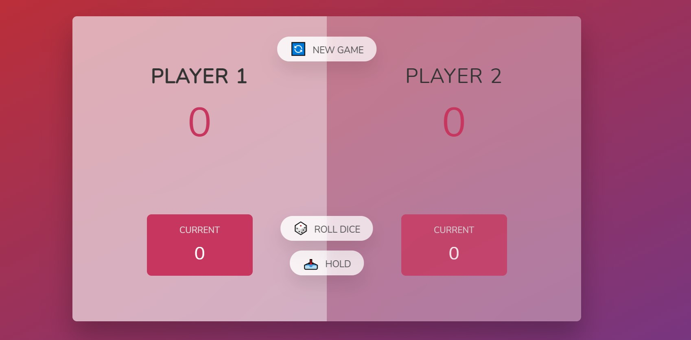

# Pig-Game

Pig game is a dice rolling game where a user scores point depending upon the score that was secured by the player. There are two players in the game. A player can hold and pass the turn to other player as well. 

## Screenshot of the website

